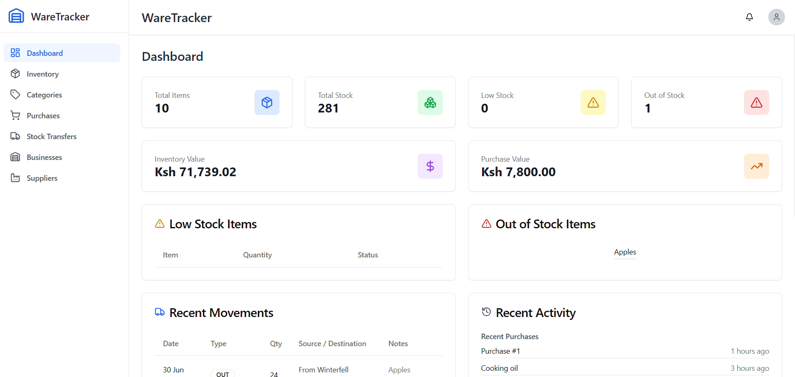
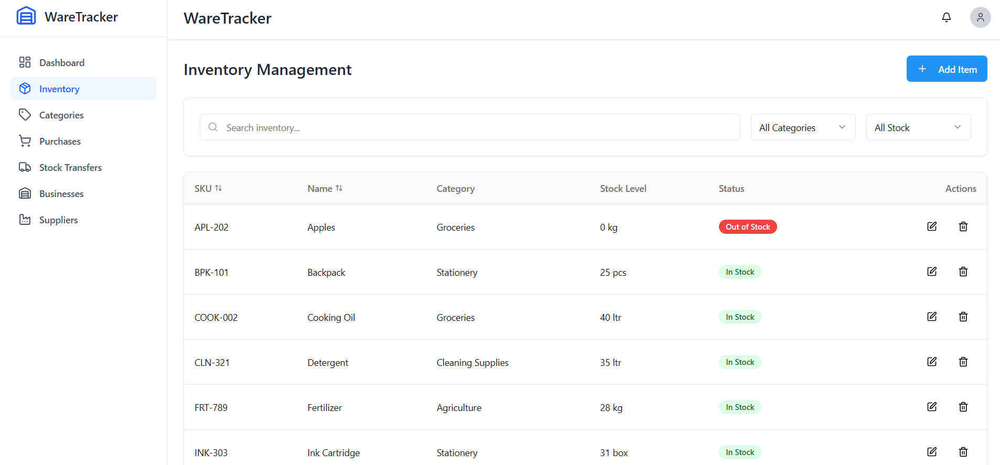
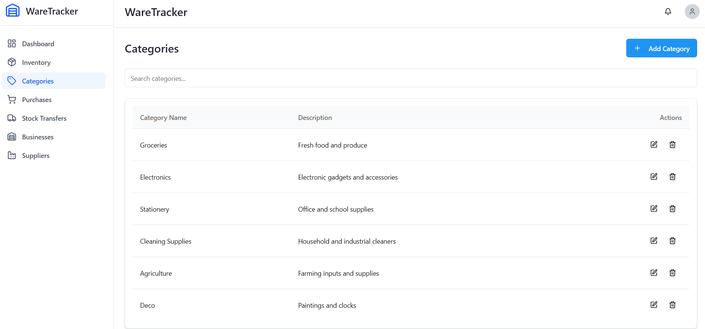
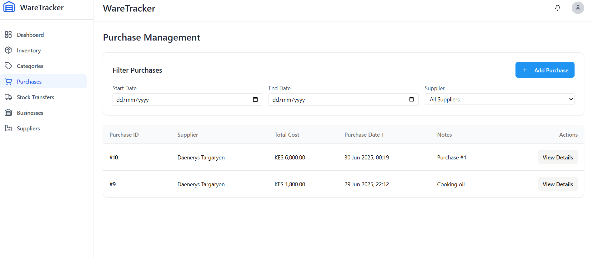
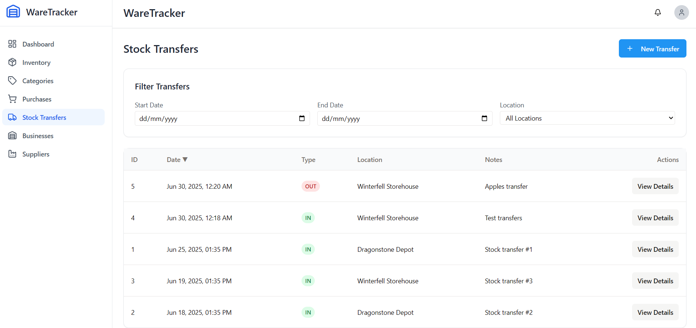
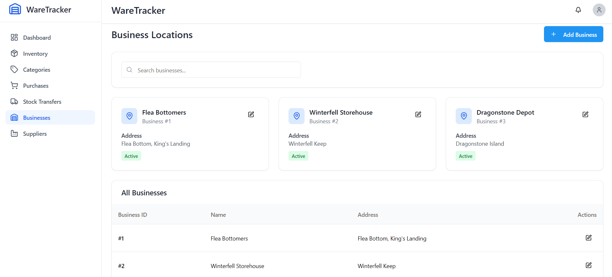
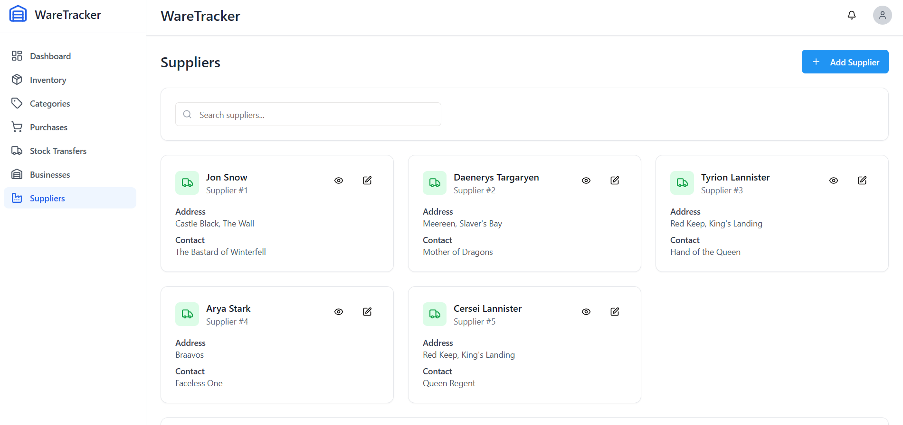

<!-- Improved compatibility of back to top link -->

[![Contributors][contributors-shield]][contributors-url]
[![Forks][forks-shield]][forks-url]
[![Stargazers][stars-shield]][stars-url]
[![MIT License][license-shield]][license-url]

 

  

  <h3 align="center">WareTracker</h3>

  

    Inventory management made simple for multi-location businesses.
     
    <a href="https://github.com/Emananii/WareTracker"><strong>Explore the repo »</strong></a>
     
     
    <a href="https://github.com/Emananii/WareTracker">View Demo</a>
    ·
    <a href="https://github.com/Emananii/WareTracker/issues/new?labels=bug&template=bug-report---.md">Report Bug</a>
    ·
    <a href="https://github.com/Emananii/WareTracker/issues/new?labels=enhancement&template=feature-request---.md">Request Feature</a>
  

  
Table of Contents

  <ol>
    <li><a href="#about-the-project">About The Project</a></li>
    <li><a href="#built-with">Built With</a></li>
    <li><a href="#usage">Usage</a></li>
    <li><a href="#roadmap">Roadmap</a></li>
    <li><a href="#contributing">Contributing</a></li>
    <li><a href="#license">License</a></li>
    <li><a href="#contact">Contact</a></li>
    <li><a href="#acknowledgments">Acknowledgments</a></li>
  </ol>

## About The Project

WareTracker is a web-based inventory management system designed to help businesses monitor stock, purchases, transfers, and locations. It supports multi-branch operations with an intuitive dashboard and modular structure.

Key features include:
- Centralized stock and purchase metrics
- Location-based tracking
- Supplier and purchase history logs
- Low stock and out-of-stock detection
- Dynamic category and business management

(<a href="#readme-top">back to top</a>)

## Built With

- React
- Tailwind CSS
- React Query
- React Hook Form
- Lucide Icons
- Zod

(<a href="#readme-top">back to top</a>)

## Usage

WareTracker allows users to:
- Add, edit, and remove inventory items
- Define, add, and assign product categories
- Track purchases and stock movements
- Manage supplier and business records

The UI is fully responsive and supports search, filtering, and modals for data entry.

(<a href="#readme-top">back to top</a>)

## Roadmap

- [x] Inventory dashboard
- [x] Category and supplier modules
- [x] Stock movement and purchase tracking
- [ ] Smart notifications
- [ ] Admin authentication
- [ ] Printable receipts

(<a href="#readme-top">back to top</a>)

## Contributing
This is a private project.

If you’ve been invited to collaborate:

1. Fork the project  
2. Create a new branch  
3. Commit changes  
4. Push your branch  
5. Open a pull request  

Top contributors:

1. Emmanuel Ndiritu
2. James Muchai
3. Lenah Mbae

## License

MIT License. See `LICENSE` for details.

## Live Demo
[WareTracker Live Demo]()

## Contact

1.Emmanuel Ndiritu  
GitHub: [@Emananii](https://github.com/Emananii)  

2.James Muchai
GitHub:[@James-Muchai](https://github.com/James-Muchai)

3.Lenah Mbae
GitHub:[@lenah-mbae](https://github.com/lenah-mbae)

(<a href="#readme-top">back to top</a>)

## Acknowledgments

- TanStack Query  
- React Hook Form  
- Lucide Icons  
- ShadCN UI  
- Zod validation  
- FontAwesome  
- GitHub Pages

(<a href="#readme-top">back to top</a>)

<!-- MARKDOWN LINKS -->
[contributors-shield]: https://img.shields.io/github/contributors/Emananii/WareTracker.svg?style=for-the-badge
[contributors-url]: https://github.com/Emananii/WareTracker/graphs/contributors
[forks-shield]: https://img.shields.io/github/forks/Emananii/WareTracker.svg?style=for-the-badge
[forks-url]: https://github.com/Emananii/WareTracker/network/members
[stars-shield]: https://img.shields.io/github/stars/Emananii/WareTracker.svg?style=for-the-badge
[stars-url]: https://github.com/Emananii/WareTracker/stargazers
[license-shield]: https://img.shields.io/github/license/Emananii/WareTracker.svg?style=for-the-badge
[license-url]: https://github.com/Emananii/WareTracker/blob/main/LICENSE

